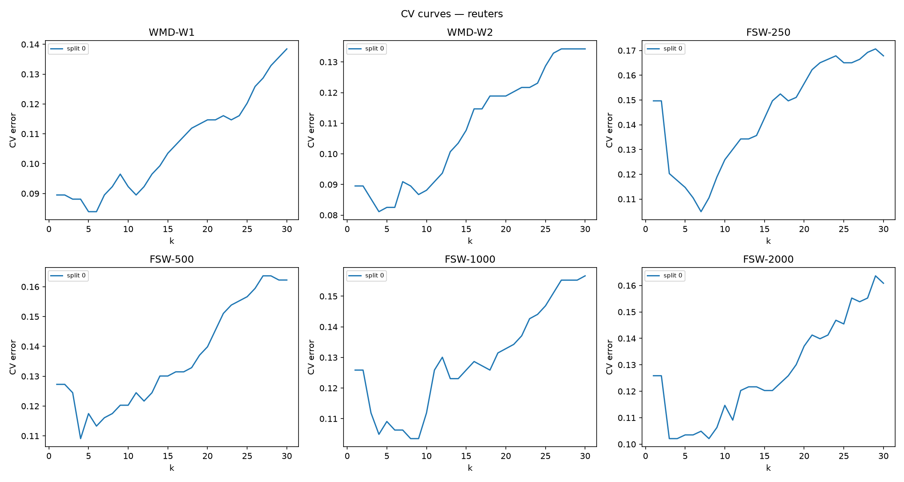
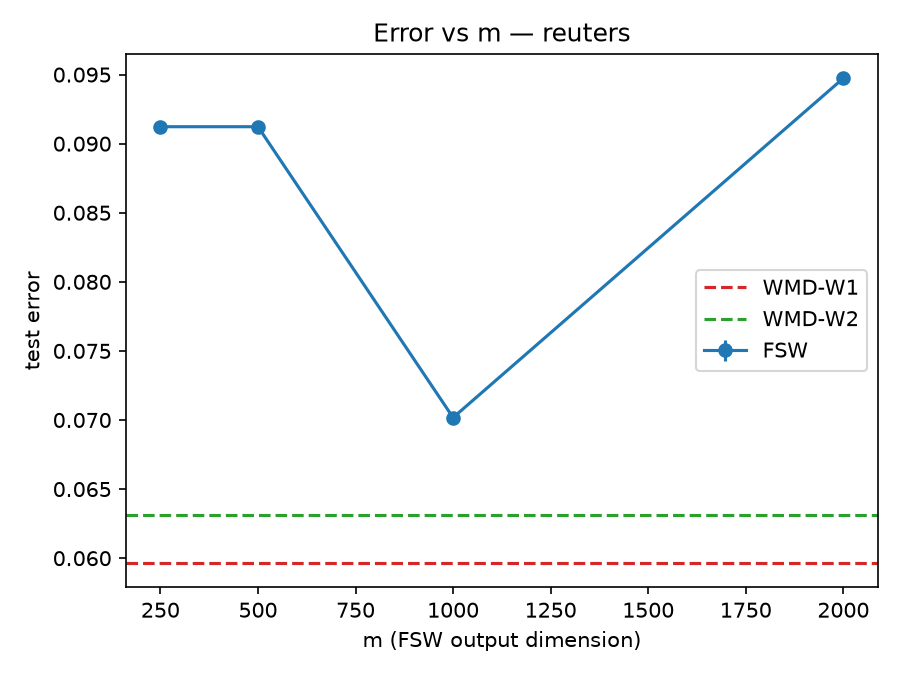

# HW4 Report

*Generated by `make_report.py` from `results/` and `figures/`. Nothing below the tables/figures was typed by hand except the discussion sections.*

## amazon

*(no results/main_table_amazon.csv yet — run run_hw4.py --dataset amazon)*

## classic

*(no results/main_table_classic.csv yet — run run_hw4.py --dataset classic)*

## reuters

### Main table (deliverable 1)

| distance | mean_test_error | std_test_error | k_stars_per_split |
| --- | --- | --- | --- |
| WMD-W1 | 0.059649 | 0.000000 | 5 |
| WMD-W2 | 0.063158 | 0.000000 | 4 |
| FSW-250 | 0.091228 | 0.000000 | 7 |
| FSW-500 | 0.091228 | 0.000000 | 4 |
| FSW-1000 | 0.070175 | 0.000000 | 8 |
| FSW-2000 | 0.094737 | 0.000000 | 3 |

### CV curves (deliverable 2)

### Error vs m (deliverable 3)

### Time table (deliverable 4)

| row | pre_embedding_mean_s | pre_embedding_std_s | per_query_mean_s | per_query_std_s | n_queries | machine |
| --- | --- | --- | --- | --- | --- | --- |
| WMD-W1 |  |  | 0.386690 | 0.237002 | 285 | codespaces-35d69c (x86_64) |
| FSW-250 | 0.762929 | 0.000000 | 0.001146 | 0.000655 | 285 | codespaces-35d69c (x86_64) |
| FSW-500 | 1.093218 | 0.000000 | 0.001766 | 0.001262 | 285 | codespaces-35d69c (x86_64) |
| FSW-1000 | 1.762365 | 0.000000 | 0.004619 | 0.004624 | 285 | codespaces-35d69c (x86_64) |
| FSW-2000 | 3.734332 | 0.000000 | 0.013409 | 0.014006 | 285 | codespaces-35d69c (x86_64) |

### Discussion (deliverable 5)

<!-- Write 6-10 sentences here, referencing the numbers above:
- Does FSW match WMD's accuracy, and for which m?
- Is the gap to WMD-W2 different from the gap to WMD-W1?
- Do the CV-vs-k curves for FSW resemble WMD's in shape, or prefer
  different neighborhood sizes?
- How do the speed numbers compare, and what do the two tables
  together say about the accuracy-speed trade? -->
